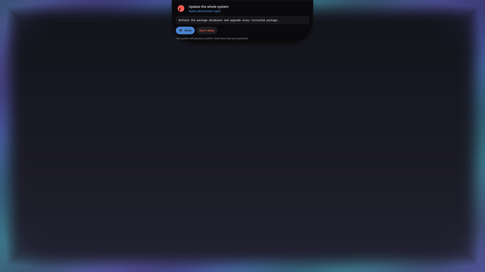
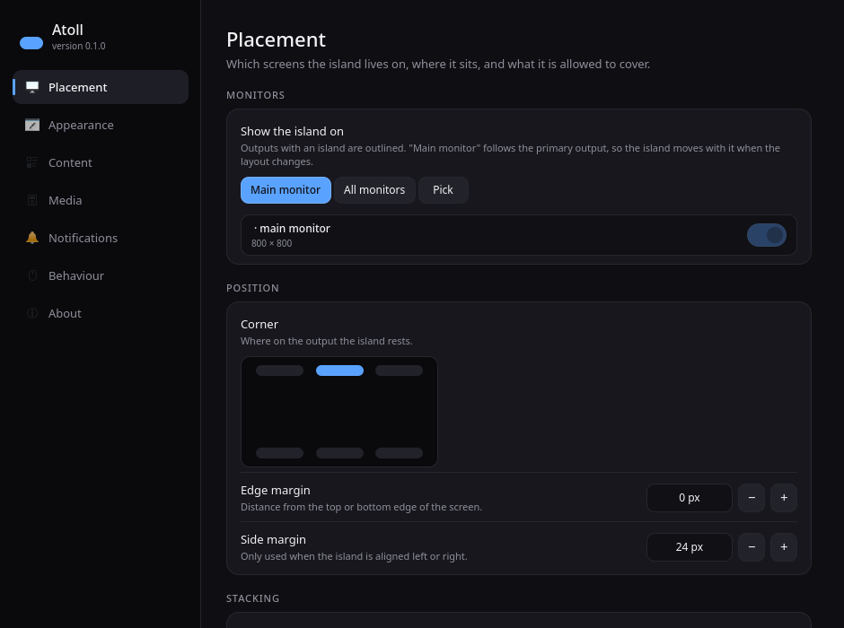

# Atoll

**A dynamic island for KDE Plasma.**

Atoll is a small overlay that grows out of the edge of your screen and morphs to
show whatever just happened: the volume you changed, the notification that
arrived, the track that started playing. Click it and it unfolds into a
dashboard with a full transport, synced lyrics, your notification backlog and a
few toggles. Right-click it for the settings window.

By default it is a **notch**: square corners against the screen edge, rounded
ones below, flush with the bezel the way a MacBook's is. It can also be a
**pill** that floats below the edge instead - one setting away.

It sits *over* the shell rather than beside it: on the overlay layer, ignoring
the space panels reserve, so it can cover a Plasma panel instead of being
pushed below one. With one line in its desktop file it can also stay up while
the session is locked - see [On the lock screen](#on-the-lock-screen).

It is a native Qt 6 / QML application built on `wlr-layer-shell` — no
Quickshell, no AGS, no Hyprland. It runs as a normal program on any Wayland
compositor that speaks layer-shell, and it is built to fit Plasma in
particular.


## What it does

| State | What you see |
|---|---|
| **Idle** | The clock, the cover of whatever is playing and a dot for anything waiting - the island always has something to show. A satellite blob buds off it while music plays. |
| **OSD** | Volume, brightness, microphone, keyboard layout, power profile — anything Plasma announces. |
| **Notification** | App icon or image, summary and body, with a progress bar for the notifications that carry one. |
| **Media** | Album art, scrolling title, album, spectrum, and transport controls that fade in on hover. While synced lyrics exist, the second line becomes the words being sung. |
| **Expanded** | Clock, battery, seekable transport, a scrolling lyrics panel, notification history and quick toggles. |
| **Sharing** | Drag files onto the island and it turns into a drop target, then a list of the devices nearby. Files coming the other way ask before they land. |
| **Assistant** | Hold the island. The screen edges light up, a question box opens, and Claude or Gemini answers — and, one permission at a time, does the thing. |

### How it gets its information

Atoll never takes anything over. It does not replace your notification daemon
and it does not replace Plasma's OSD:

- **OSD events** are read by watching the method calls Plasma already sends to
  `org.kde.osdService`. That means hardware keys, third-party mixers and
  Plasma's own applets all reach the island without polling PipeWire.
- **Notifications** are read the same way, by asking the bus daemon to make
  Atoll a monitor. Your real daemon — Plasma's, dunst, whatever you run —
  keeps doing its job; Atoll mirrors it. Pairing each observed `Notify` call
  with its reply also recovers the id the daemon handed out, which is what
  makes closing a notification from the island possible.
- **Media** is plain MPRIS2, so Spotify, a browser tab and a local player all
  reach the island the same way: title, artist, album, cover art and position.
  Remote cover art (Spotify hands out an https URL) is fetched once and cached.
- **Lyrics** come from an `.lrc` file next to a local track when there is one,
  and otherwise from [lrclib.net](https://lrclib.net). See
  [Network](#network) - it is the only request Atoll ever makes.
- **Nearby devices** are found over the LocalSend protocol: a multicast group
  everyone announces themselves into, and a small HTTP server for the files
  themselves. See [Sharing files](#sharing-files).
- **The accent colour** follows the dominant colour of the current album art.

### Where it appears

By default: one island, on the main monitor, centred at the top, drawn over
whatever Plasma has there. All three parts of that are settings.

- **Screens** - the main monitor (which it keeps following when you dock,
  undock or change which output is primary), every monitor at once, or a
  hand-picked set. Plugging a monitor in or out adds and removes islands by
  itself.
- **Shape** - a notch flush with the edge, or a floating pill.
- **Position** - any of the six edge positions, with margins.
- **Stacking** - which compositor layer to sit on, and whether to cover panels
  or make room for them.

## Installing

Dependencies: `qt6-base qt6-declarative qt6-svg layer-shell-qt kcoreaddons ki18n dbus wayland`,
plus `cmake ninja qt6-shadertools extra-cmake-modules wayland` to build
(`wayland-scanner` generates the lock-screen protocol; without it everything
else still builds).
Optional: `cava` for a real spectrum, `wireplumber` for volume control,
`openssl` for encrypted sharing (see [Sharing files](#sharing-files)),
`polkit` and a polkit agent so the assistant can ask for administrator rights,
`libsecret` to keep its API key in your keyring, and
`xdg-desktop-portal-kde` to let it look at your screen.

```sh
cmake -S . -B build -G Ninja -DCMAKE_BUILD_TYPE=Release -DCMAKE_INSTALL_PREFIX=/usr
cmake --build build
sudo cmake --install build
```

On Arch there is a `packaging/PKGBUILD`.

Start it with `atoll`, or enable the bundled user service:

```sh
systemctl --user enable --now atoll.service
```

## The assistant

Press and hold the island. The edges of the screen light up, and a box opens
asking what you want.



You can ask it things ("why is my fan so loud", "what is taking up my disk"),
and you can ask it to *do* things ("install Firefox and make it the default",
"update my system", "set my wallpaper to that photo from Tuesday"). It works on
this machine, with the tools it has been given: run a command, read and write
files, install packages, change a Plasma setting, open an app, take a look at
the screen.

### It asks before it acts

Every action the assistant wants to take is sorted into one of three tiers
before it happens, and the assistant does not get to choose the tier — Atoll
looks at what the action would actually do:

| Tier | What it covers | What happens |
|---|---|---|
| **Reads** | Listing a directory, reading a file, `pacman -Q`, `systemctl status` | Runs straight away. Nothing here is anything you could not have looked at yourself. |
| **Changes your session** | Writing in your home directory, changing a Plasma setting, opening an app | Asks. You can allow it once, or for the rest of the session. |
| **Administrator** | Installing packages, a system upgrade, anything as root | Asks every time, and then **your desktop** asks — the ordinary polkit dialog, which honours a password, a fingerprint or a hardware key exactly as it does everywhere else. |

The point of that middle column is that a model asking nicely for root does not
get it. If the work fits inside your own account, that is where it runs.
Atoll never sees, stores or types your password, and a handful of operations —
wiping a disk, rewriting the password database, piping a download straight into
a shell — are refused no matter who asks or how the request is worded. Your
keys, `~/.ssh`, `~/.gnupg` and your keyring are never opened for it at all.

You decide how much of this is on at all, under **Settings → Assistant**:
*Look only* never changes anything, *Ask first* is the default, *Trust it*
stops asking about your own files but still sends every root action through
polkit. Administrator access can be switched off outright.

### Long jobs

A system upgrade takes a while, and you should not have to watch it. Press
**Continue in background**: the glow goes away, the panel closes, and the
island keeps a small face on the pill that reports progress. Click it to bring
the conversation back. If the assistant needs an answer from you, it comes back
by itself.

### Connecting it

Atoll talks to Claude or Gemini directly. There is no Atoll account and no
server in between: your question goes from your machine to the provider you
picked, and nowhere else.

Hold the island before you have set one up and it offers to open the settings
for you. There you paste an API key from
[console.anthropic.com](https://console.anthropic.com) or
[aistudio.google.com](https://aistudio.google.com). If `libsecret` is installed
the key goes into your keyring, encrypted at rest and unlocked with your login;
otherwise into a file only you can read, and the settings page says which
happened. `ANTHROPIC_API_KEY` and `GEMINI_API_KEY` from your environment are
picked up as well, so a machine that is already set up needs no configuration.

Turn the whole thing off with **Settings → Assistant → Assistant**, and the
long press, the glow and every line of it go away.

## On the lock screen

Atoll can stay visible while the screen is locked. KWin only hands the
`kde_lockscreen_overlay_v1` protocol to programs that ask for it by name, so
this needs two things:

- Atoll must be **installed**, not run from a build directory. KWin matches the
  running executable against the `Exec=` line of `io.github.atoll.Atoll.desktop`,
  which is why that line carries an absolute path and
  `X-KDE-Wayland-Interfaces=kde_lockscreen_overlay_v1`.
- `lockScreen.enabled` must be on. The permission is asked for before the
  window is mapped, so changing it takes a restart of the island.

What the island shows there is deliberately narrower than what it shows on an
unlocked desktop, because anybody walking past can read it:

| Key | Default | Meaning |
|---|---|---|
| `lockScreen.showMedia` | `true` | Cover, title and artist stay visible. |
| `lockScreen.showNotifications` | `false` | Notification summaries and bodies stay hidden. |
| `lockScreen.allowExpanding` | `false` | The dashboard - and with it the notification history - cannot be opened. |

Locking the screen also collapses an open dashboard.

## Settings

`atoll --settings`, `atollctl settings`, a right-click on the island, or the
gear in the dashboard opens the settings window. It runs as its own process and
edits the same file the island watches, so every switch lands on the island as
you flip it - there is no apply button.



## Controlling it

Atoll exposes `org.atoll.Atoll` on the session bus, which makes the island a
general purpose heads-up display for your own scripts:

```sh
atollctl text drive-harddisk "Backup finished"
atollctl progress cloud-upload 64 "Uploading"
atollctl share ~/Pictures/holiday.jpg
atollctl ask "why is my laptop fan so loud"
atollctl toggle
atollctl settings
```

```sh
atollctl assistant           # open it with an empty box
```

Binding `atollctl assistant` to a key in **System Settings → Shortcuts** gives
the assistant a shortcut of its own, for the times the island is not where the
pointer is.

Interaction: click to expand, **hold** for the assistant, right-click for the
settings, middle-click to play/pause, scroll to change volume, hover to reveal
transport controls. Every one of those is configurable.

## Sharing files

Drag files - or a whole folder - onto the island. It grows into a drop target
while the drag is over it, and once the files are dropped it lists the devices
it can see; click one and they go. Files arriving the other way announce
themselves the same way, with an Accept and a Decline, and land in your
downloads folder.

**It speaks [LocalSend](https://localsend.org), not AirDrop.** AirDrop has been
reverse-engineered - by the Open Wireless Link project, and more recently by
Google for the Pixel's Quick Share - but on Linux it remains impractical: it
rides on AWDL, Apple's own link layer, and the open implementations need a
wifi card that can be driven in monitor mode with frames injected into it,
which takes the card off the network it was on. LocalSend is documented, has
an app on every platform including iOS and Android, and needs nothing but the
network you are already on. So: install LocalSend on the phone, and the notch
is the desktop half of it.

How it works, briefly:

- Devices find each other on the multicast group `224.0.0.167:53317`, and
  answer each other over HTTP. Nothing leaves the local network, and there is
  no account and no server anywhere.
- Transfers are TLS between two self-signed strangers: the SHA-256 of the
  certificate *is* a device's identity in this protocol, so nothing is
  verified against a certificate authority. Atoll makes its certificate on
  first run with `openssl` and keeps it in `~/.local/share/atoll`. Without
  `openssl` installed sharing falls back to cleartext HTTP, which the
  LocalSend app will not connect to.
- The port is 53317, or the next free one - so Atoll and the LocalSend app can
  run side by side on the same machine.

| Key | Default | Meaning |
|---|---|---|
| `modules.sharing` | `true` | The drop target and the discovery of nearby devices. |
| `sharing.alias` | hostname | How this machine introduces itself. |
| `sharing.receive` | `true` | Whether incoming files are accepted at all. |
| `sharing.autoAccept` | `false` | Take offered files without asking. |
| `sharing.saveDirectory` | your downloads | Where received files land. |
| `sharing.port` | `53317` | HTTP and multicast port. |

`atollctl share <file>...` offers files from a script or a file manager's
"send to" menu, exactly as if they had been dropped on the island.

## Configuring

`~/.config/atoll/atoll.json` is written on first run with every default
spelled out, and it is re-read live — save the file and the island changes
while you watch. Keys you are most likely to want:

| Key | Meaning |
|---|---|
| `island.screens` | `["primary"]`, `["all"]`, or output names such as `["HDMI-A-1", "DP-2"]`. |
| `island.shape` | `"notch"` sits flush against the edge, `"pill"` floats below it. |
| `island.position` | `"top-center"`, `"top-left"`, `"top-right"`, or the three `bottom-*` variants. |
| `island.overlapPanels` | `true` draws over Plasma's panels; `false` respects `island.exclusiveZone`. |
| `island.layer` | `"overlay"`, `"top"`, `"bottom"` or `"background"`. |
| `island.idleMode` | `"auto"`, `"clock"`, `"notch"` or `"hidden"`. |
| `island.alwaysVisible` | Keeps the island on screen even in `"hidden"` mode. |
| `appearance.accent` | `"auto"` follows the album art, or pin a colour. |
| `effects.gooey` | The metaball merge between the island and its satellite. |
| `notifications.ignoredApps` | Apps the island should stay quiet about. |
| `media.preferred` | Player names to favour, in order. |
| `lyrics.enabled` | Whether to look lyrics up at all. |
| `lyrics.offsetMs` | Shifts every lyric line, for players that report position late. |
| `sharing.autoAccept` | Take offered files without asking first. |
| `lockScreen.enabled` | Whether to ask to stay visible while the session is locked. |

Configs written before islands could span outputs still work: an
`island.screen` string is used when `island.screens` is missing.

## Network

Atoll makes exactly one kind of outbound request, and only when
`lyrics.enabled` is on and a track has no local `.lrc` file: a lookup at
`lrclib.net` carrying the artist, title, album and duration of what is playing.
Results are cached under `~/.cache/atoll/lyrics`. Turn it off in the settings
window under *Media and lyrics*, or with `"lyrics": { "enabled": false }`.

Remote cover art is fetched from whatever URL the player advertises - that is
the player's server, not ours.

Sharing is local traffic only: a multicast announcement on `224.0.0.167:53317`
and HTTP(S) straight between the two devices. Turn the whole thing off with
`"modules": { "sharing": false }` and Atoll stops listening and announcing.

## Troubleshooting

| Variable | Effect |
|---|---|
| `ATOLL_DEBUG_STATE=1` | Logs every state change and incoming event. |
| `ATOLL_DEBUG_SURFACE=1` | Paints the whole layer surface so its bounds are visible. |
| `ATOLL_DEBUG_GRAB=<path>` | Saves one rendered frame and exits (`ATOLL_DEBUG_GRAB_DELAY` in ms). |
| `ATOLL_NO_LAYER_SHELL=1` | Falls back to an ordinary window, for X11 or a nested compositor. |

If the island says it cannot watch the session bus, the bus daemon refused
`BecomeMonitor`; media control still works but OSD and notification mirroring
do not.

## Known limitations

- Notification **actions** are best effort. As a bus observer Atoll can
  re-broadcast `ActionInvoked`, but senders that filter on the daemon's bus
  name will ignore it.
- One island process per session. It serves every output you asked for; a
  second instance refuses to start.
- Staying on the lock screen only works on KWin, and only for an installed
  Atoll. Other compositors do not offer the protocol, and the island then
  disappears with the session like any other window.
- Sharing is LocalSend, not AirDrop: an Apple device needs the LocalSend app
  to appear in the list. Sending to the LocalSend app also needs `openssl`
  present when Atoll first runs, because that app refuses cleartext peers.
- The assistant needs an API key of your own, and every question costs whatever
  the provider charges. Atoll adds nothing to that and takes no cut; there is
  no free tier to fall back on.
- What the assistant can do is bounded by the tools it has and by the
  permission tiers above, not by how convincing its explanation is. It is still
  a language model: read the command in the prompt before you allow it, the
  same way you would read a command somebody pasted into a forum answer.
- Lyrics are only as good as the database. Anything lrclib has never seen shows
  as "No lyrics for this track"; an `.lrc` file next to a local track always
  wins.

## License

GPL-3.0-or-later. See [LICENSE](LICENSE).
